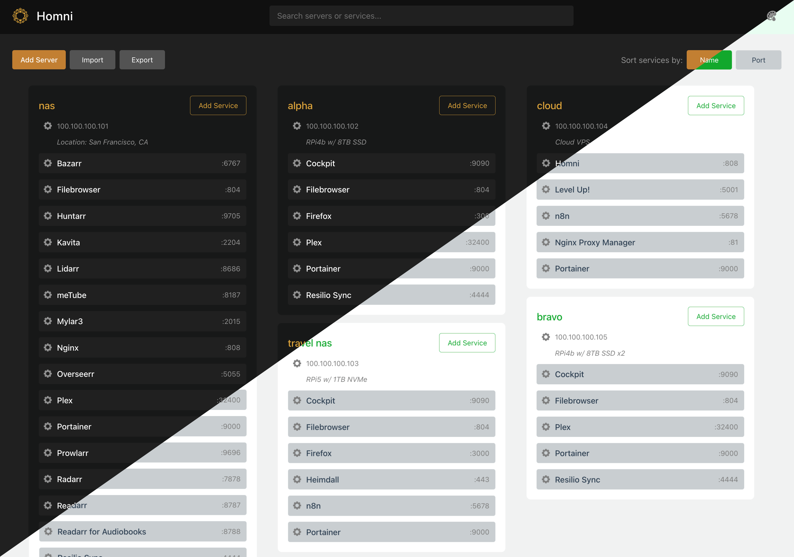

# Homni

Organize and access all your servers and services from one clean dashboard.



## Quick Start

```bash
docker run -d -p 8088:80 --name homni $(docker build -q .)
```

Then open http://localhost:8088.

Or use Docker Compose:

```bash
docker compose -f config/docker-compose.yml up -d
```

## Features

- **Instant setup** -- no accounts, no config files, no database
- **Search** across all servers and services with smart priority filtering
- **Dark and light themes** with full color customization
- **Import/Export** your configuration as JSON for backup or sharing
- **Keyboard shortcuts** for fast navigation (Alt+A, Alt+I, Alt+E, Alt+P, /)
- **Responsive** masonry grid layout

## How It Works

All data is stored in your browser's IndexedDB. Nothing is sent to any server. You can export your full configuration as a JSON file and import it on any device.

## Project Structure

```
src/            Source code (React/TypeScript)
web/            Production build output
config/         Nginx, Docker Compose, Vite, and TypeScript configs
scripts/        Server, Docker, backup, and utility scripts
docs/           Documentation
```

## Development

```bash
npm install
npm run build       # Build to ./web
./run-local.sh      # Serve locally on port 8080
```

See [docs/SCRIPTS.md](docs/SCRIPTS.md) for full script reference.

## Documentation

- [Product Requirements](docs/PRD.md)
- [UI Design Guide](docs/UI_DESIGN_GUIDE.md)
- [Scripts Reference](docs/SCRIPTS.md)
- [Release Notes](docs/RELEASE_NOTES.md)

## Privacy

All server and service data is stored exclusively on your device using IndexedDB (with localStorage fallback). No data is transmitted externally. Backups are local JSON files you control.

## License

Copyright 2024 James Forwood. All Rights Reserved.
